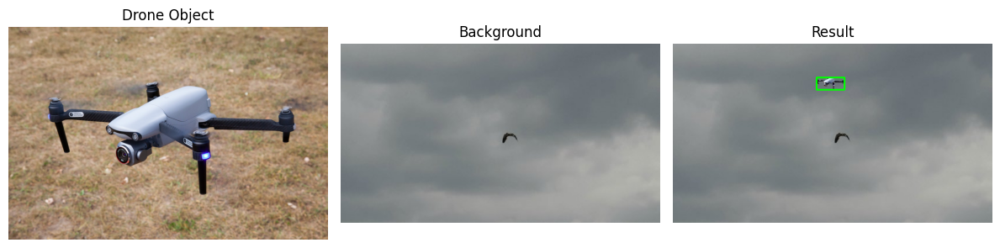
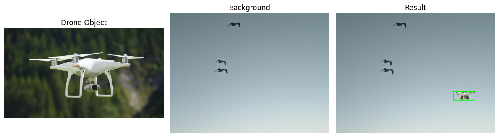
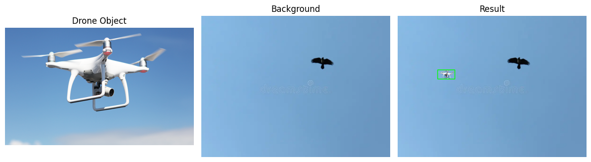

# Custom Scale Augmentation
---------------------------------------------------

The "Custom Scale Augmentation" project focuses on implementing a custom scaling technique tailored specifically for drone objects within images. 





## Getting Started

### Prerequisites

Ensure you have the following dependencies installed:

- Python (>=3.6)
- PyTorch (>=1.7.0)

Install additional dependencies by running:

```bash
pip install -r requirements.txt
```

### Usage Example

To utilize the `Custom_Scal_Augmentation` function, follow this example:

```python
from your_module import Custom_Scal_Augmentation

Custom_Scal_Augmentation(drone_img_file = drone_img, 
                         background_img_file = background_img, 
                         scale_factor = 0.1,
                         offset='random', 
                         class_label=0, 
                         plot_steps=True,
                         save=True, 
                         lbl_file='lbl.txt')
```

Parameters:
- drone_img_file: Path to the The image containing the drone object.
- background_img_file: Path to the background image on which the drone will be added.
- scale_factor: The scaling factor applied to the drone object.
- offset: Offset parameter for the positioning of the drone object. Default is 'random'.
- class_label: The class label assigned to the drone object. Default is 0.
- plot_steps: Whether to visualize intermediate steps during augmentation. Default is True.
- save: Whether to save the augmented image and bounding box labels. Default is True.
- lbl_file: Filename for saving bounding box labels in YOLOv8 format. Default is 'lbl.txt'.


## Contributing

Feel free to contribute by opening issues or pull requests.
